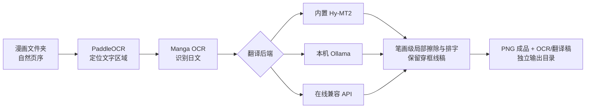

# Manga Localizer Studio

本地优先的日语漫画中文化工作台：按自然页序检测文字、识别日文、结合前后页保持剧情与称呼连贯，最后只在文字区域内重绘中文，不覆盖源文件。


## 特性

- **故事连贯**：按连续页分块翻译，并携带前文、固定译名和角色语气约束。
- **保护画面**：用紧凑文字框和连通域遮罩只清除日文字形，输出保持原分辨率；源目录只读，结果写入新目录。
- **三种推理后端**：内置 Hy-MT2、本机 Ollama、在线 OpenAI 兼容 API 可随时切换。
- **隐私边界清晰**：本地模式不外传数据；在线模式只发送 OCR 文本和上下文，不上传图片。
- **ModelScope 优先**：Hy-MT2 与 PaddleX 权重优先从魔搭社区获取；Manga OCR 暂无等价镜像，明确回退到上游模型源。
- **开箱即用**：首次启动创建隔离 `.venv`、按硬件安装 CPU/NVIDIA 依赖并下载权重。
- **字体自带方案**：安装器预取固定版本的 Noto Sans CJK SC；缺失时渲染器也会自动补齐。
- **UI + CLI**：浏览器工作台适合日常使用，CLI 适合批量和自动化。

## 三步开始

要求：Windows 10/11 或 Linux、约 8 GB 可用磁盘。推荐安装 [uv](https://docs.astral.sh/uv/)；uv 会自动准备 Python 3.12 和锁定环境。没有 uv 时仍会回退到系统 Python + pip。CPU 可以运行，NVIDIA GPU 更快。

### Windows

```powershell
git clone https://github.com/whmc76/manga-localizer-studio.git
cd manga-localizer-studio
.\start-windows.bat
```

首次启动会自动完成环境安装并打开 `http://127.0.0.1:8765`。先在 UI 选择推理后端，再点“准备缺失模型”；内置模式约需 5 GB，Ollama/在线模式无需下载 Hy-MT2。之后双击 `start-windows.bat` 即可。

尚未安装 uv 时，可先执行 `winget install --id=astral-sh.uv -e`；这一步不是强制要求。

### Linux

```bash
git clone https://github.com/whmc76/manga-localizer-studio.git
cd manga-localizer-studio
chmod +x scripts/*.sh
./scripts/start.sh
```

只创建环境、不下载权重：

```powershell
.\scripts\bootstrap.ps1 -Profile cpu -SkipModels -Dev
```

```bash
./scripts/bootstrap.sh --cpu --skip-models --dev
```

## 使用

1. 选择漫画图片文件夹；支持 JPG、PNG、WebP、BMP 和 TIFF。
2. 选择内置 Hy-MT2、本机 Ollama 或在线兼容 API，并按需设置“剧情连贯”“前文页数”和“保留拟声词”。
3. 模型未就绪时点“准备缺失模型”；只会下载当前后端需要的本地权重。
4. 在对比预览中检查结果；PNG 成品、逐页 OCR 与翻译稿都保存在输出目录。

CLI 与 UI 使用同一条流水线：

```bash
manga-localizer run "D:/manga/chapter-01" -o "D:/manga/chapter-01_zh"
manga-localizer run "D:/manga/chapter-01" -o "D:/manga/chapter-01_zh" --backend ollama --ollama-model qwen2.5:7b
manga-localizer models status
manga-localizer doctor
```

在线兼容 API 使用 `--backend online --online-url ... --online-model ...`，密钥通过
`MLS_ONLINE_API_KEY` 环境变量提供。UI 中输入的密钥只保留在当前服务进程内，不写入磁盘。

## 工作原理



| 模块 | 默认方案 | 下载策略 |
|---|---|---|
| 文字定位 | PP-OCRv5 | PaddleX 强制 `modelscope` 源 |
| 日文识别 | Manga OCR | 上游源回退，并在 UI 标明 |
| 连贯翻译 | Hy-MT2 / Ollama / 在线兼容 API | 后端可选；共用连续页提示词与漏行补译 |
| 画面修复 | OpenCV 局部掩膜 + Pillow 排字 | 无远程服务 |

缓存默认位于 `~/.manga-localizer-studio`，可通过 `MLS_HOME` 改变。自动字体保存在 `fonts/`，模型保存在 `models/`；也可通过 `MLS_FONT` 指向自己的 TTF/OTF/TTC 文件。

## 设计与工程约束

- 原始图片从不被覆盖；API 也拒绝相同的源/输出目录。
- 像素变化限制在检测框周围的有界清理区；边缘连通的角色、背景和分镜线会被保留，回归测试覆盖该约束。
- 翻译保留稳定单元 ID，模型漏行时逐条补译，避免气泡错位。
- 模型状态、进度、历史和预览均来自真实本地 API，不使用伪造 UI 状态。
- 首版最适合印刷体日文漫画；复杂手写字、跨画面大字和纹理背景仍建议人工复核。

设计基线、响应式规则和逐项验收记录见 [`docs/DESIGN_CONTRACT.md`](docs/DESIGN_CONTRACT.md) 与 [`docs/PARITY_LEDGER.md`](docs/PARITY_LEDGER.md)。

## 开发

```powershell
.\scripts\bootstrap.ps1 -Profile cpu -SkipModels -Dev
uv lock --check
uv run --frozen --no-sync pytest
uv run --frozen --no-sync manga-localizer ui --no-open
```

普通与 ML 依赖（含 CPU Paddle）记录在 `uv.lock`；Torch 再由启动脚本按 CPU/CUDA 12.9 安装对应轮子。Windows CUDA 配置使用 GPU Torch + CPU Paddle，避免两套运行时在同一进程加载冲突的 cuDNN DLL；文字识别与翻译仍使用 GPU。Linux CUDA 可把 Paddle 替换为 GPU wheel。CI 使用官方 `setup-uv`，在 Windows/Linux、Python 3.11/3.12 上运行不下载权重的核心测试。完整模型测试需在本地执行。

## 许可证与模型说明

项目源码使用 [MIT License](LICENSE)。下载的模型权重不随仓库分发，沿用各自上游许可证；详见 [MODEL_LICENSES.md](MODEL_LICENSES.md)。请只处理你有权翻译和发布的内容。

## 致谢

核心能力来自 [PaddleOCR](https://github.com/PaddlePaddle/PaddleOCR)、[Manga OCR](https://github.com/kha-white/manga-ocr)、[ModelScope](https://modelscope.cn/) 与 [Hy-MT2](https://modelscope.cn/collections/Tencent-Hunyuan/Hy-MT2)。
