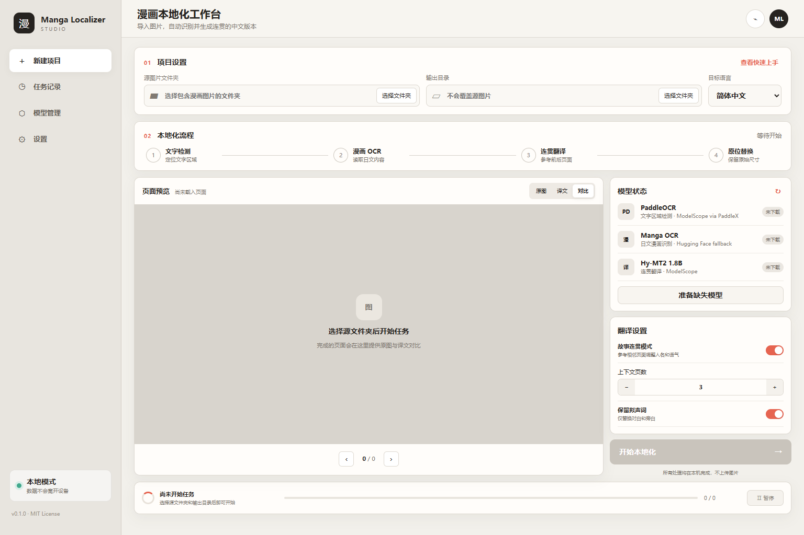
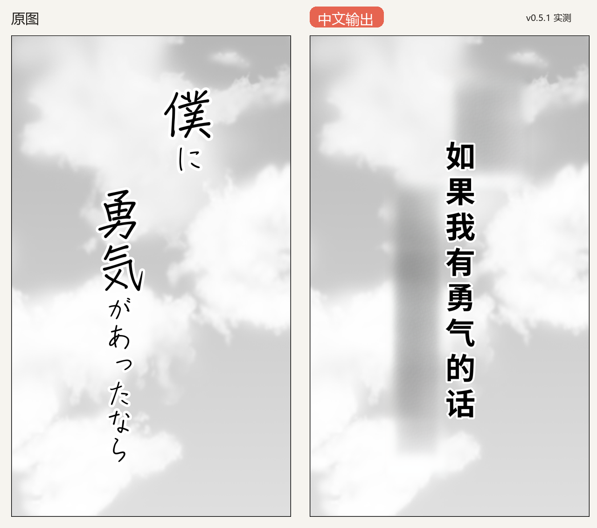
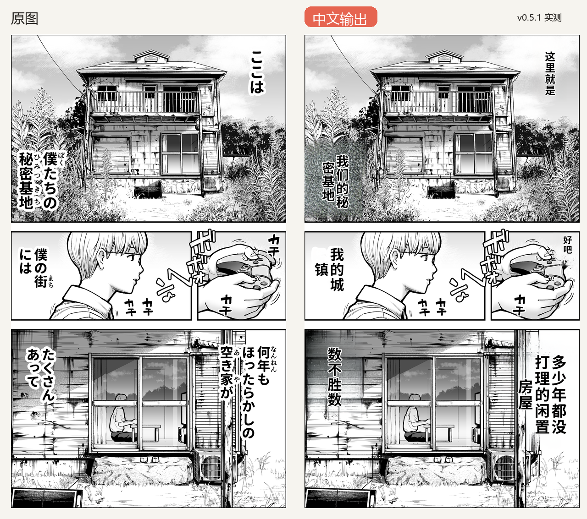
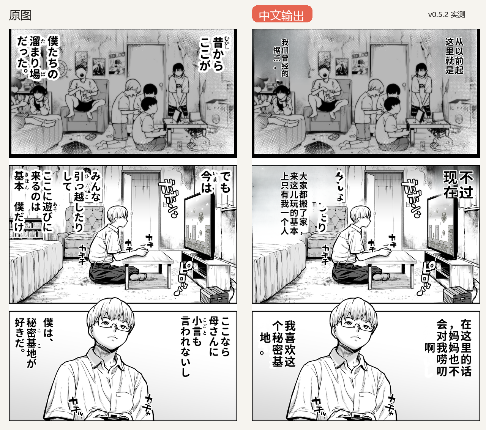
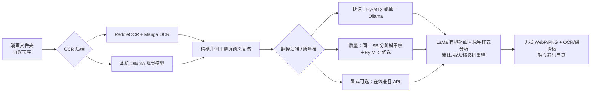

# Manga Localizer Studio

本地优先的日语漫画中文化工作台：按自然页序检测文字、识别日文、结合前后页保持剧情与称呼连贯，最后只在文字区域内重绘中文，不覆盖源文件。



## 实机效果：前三页对比

下面三张图来自 v0.5.2 对一部 125 页漫画的全书本地实测，使用当前项目的通用 OCR、自动人名统一、9B 上下文审校、LaMa 补画和样式重建模块；没有人工人名表，也没有调用在线 LLM API。共处理 1,285 个文字单元：替换中文 690 个、明确跳过 7 个、保留大型或装饰性拟声词 588 个，未解决单元 0、无效译文 0、声明区域外变化像素 0。README 只做等比例缩略展示，125 张成品均保持各自源图的原生像素尺寸；擦除和补画只采用精确检测器拥有的几何区域。完整指标见 [`docs/benchmarks/V0.5_FULL_BOOK_REPORT.md`](docs/benchmarks/V0.5_FULL_BOOK_REPORT.md)。







## 特性

- **故事连贯**：默认携带前 6 页成稿；全书扫描反复出现的片假名角色名，通过 JMnedict、自然中文姓名候选过滤和本地 9B 裁决生成一致性约束，不需要为具体作品维护人工人名表。
- **本地质量集成**：质量模式由同一个无限制 9B 模型分阶段完成草稿、上下文裁决和语义风险复译，Hy-MT2 1.8B 提供独立候选；不下载或依赖 9B 以上模型。快速模式仍可只运行单一轻量模型。
- **质量 OCR**：Paddle 精确框 + Manga OCR 日文识别 + 9B 漏字/语义审计；视觉模型报告的漏字必须经过已有框覆盖判断、局部放大 Paddle 重检和 Manga OCR 独立确认，粗 VLM 框永远不直接擦图。
- **原字样式匹配**：不依赖多模态 LLM，直接分析横竖排、字号、字重、前景色、描边色/宽度、字距和展示文字占比；自动使用常规或粗体中文字体重排。
- **保护画面**：保持原始像素尺寸，不覆盖源图；LaMa 推理后强制逐像素恢复掩膜外区域，测试验证有界编辑契约。
- **可追踪审校**：可导入已审校 `transcript.json`；旧式 `skip: true`、残留日文假名和提示词泄漏都会被判为未解决并阻止“完成”。
- **本地后端可组合**：翻译可选内置 Hy-MT2 或本机 Ollama；OCR 可选内置专用方案或 Ollama 视觉模型。在线兼容接口仅是显式可选项。
- **隐私边界清晰**：本地模式不外传数据；在线模式只发送 OCR 文本和上下文，不上传图片。
- **ModelScope 优先**：Hy-MT2 与 PaddleX 权重优先从魔搭社区获取；Manga OCR 暂无等价镜像，明确回退到上游模型源。
- **开箱即用**：uv 创建隔离 `.venv`、按硬件安装 CPU/NVIDIA 依赖；UI 可准备所需权重，质量模式首次运行会自动准备 Hy-MT2、9B 本地模型和校验过的 LaMa。
- **字体自带方案**：安装器预取固定版本的 Noto Sans CJK SC Regular/Bold；系统字体可用时直接复用。
- **体积可控**：默认输出逐像素无损 WebP；仍可选择无损 PNG。测试封面 WebP 约为 PNG 的 59%。
- **UI + CLI**：浏览器工作台适合日常使用，CLI 适合批量和自动化。

## 三步开始

要求：Windows 10/11 或 Linux。轻量快速模式约需 8 GB 可用磁盘；完整本地质量模式只使用 9B 或更小的 Ollama 模型，并按阶段释放显存。推荐安装 [uv](https://docs.astral.sh/uv/)；uv 会自动准备 Python 3.12 和锁定环境。没有 uv 时仍会回退到系统 Python + pip。

### Windows

```powershell
git clone https://github.com/whmc76/manga-localizer-studio.git
cd manga-localizer-studio
.\start-windows.bat
```

首次启动会自动完成环境安装并打开 `http://127.0.0.1:8765`。默认方案完全在本机运行；先选择 OCR/翻译后端，再点“准备缺失模型”。Ollama 的快速模式不需要 Hy-MT2；质量模式会把 Hy-MT2 作为独立候选。使用纯 Ollama OCR 时无需下载 Paddle/Manga OCR，但推荐的混合质量 OCR 需要它们。之后双击 `start-windows.bat` 即可。

从旧版本更新源码后，请运行一次 `.\scripts\bootstrap.ps1 -SkipModels`（Linux 为 `./scripts/bootstrap.sh --skip-models`）同步锁定环境；已有模型权重不会重复下载。

尚未安装 uv 时，可先执行 `winget install --id=astral-sh.uv -e`；这一步不是强制要求。

### Linux

```bash
git clone https://github.com/whmc76/manga-localizer-studio.git
cd manga-localizer-studio
chmod +x scripts/*.sh
./scripts/start.sh
```

只创建环境、不下载权重：

```powershell
.\scripts\bootstrap.ps1 -Profile cpu -SkipModels -Dev
```

```bash
./scripts/bootstrap.sh --cpu --skip-models --dev
```

## 使用

1. 选择漫画图片文件夹；支持 JPG、PNG、WebP、BMP 和 TIFF。
2. 分别选择 OCR 与翻译后端，并按需设置“剧情连贯”“前文页数”“保留拟声词”和无损输出格式。
3. 模型未就绪时点“准备缺失模型”；只会下载当前后端需要的本地权重。
4. 在对比预览中检查结果；无损 WebP/PNG 成品、逐页 OCR 与翻译稿都保存在输出目录。WebP 是默认值，可明显减小 PNG 带来的体积膨胀且不改变解码后的像素。

CLI 与 UI 使用同一条流水线：

```bash
manga-localizer run "D:/manga/chapter-01" -o "D:/manga/chapter-01_zh"
manga-localizer run "D:/manga/chapter-01" -o "D:/manga/chapter-01_zh" --backend ollama --quality-profile quality
manga-localizer run "D:/manga/chapter-01" -o "D:/manga/chapter-01_fast" --backend ollama --quality-profile fast
manga-localizer run "D:/manga/chapter-01" -o "D:/manga/chapter-01_zh" --ocr-backend ollama --ollama-ocr-model huihui_ai/qwen3.5-abliterated:9b
manga-localizer run "D:/manga/chapter-01" -o "D:/manga/chapter-01_png" --output-format png
manga-localizer run "D:/manga/chapter-01" -o "D:/manga/chapter-01_final" --reviewed-transcript "D:/manga/transcript-reviewed.json"
manga-localizer models status
manga-localizer doctor
```

在线兼容 API 使用 `--backend online --online-url ... --online-model ...`，密钥通过
`MLS_ONLINE_API_KEY` 环境变量提供。UI 中输入的密钥只保留在当前服务进程内，不写入磁盘。

## 工作原理



| 模块 | 默认方案 | 下载策略 |
|---|---|---|
| 文字定位 | PP-OCRv5 mobile det + server rec | PaddleX 强制 `modelscope` 源 |
| 日文识别 | Manga OCR | 上游源回退，并在 UI 标明 |
| 连贯翻译 | 同一 9B 分阶段草稿/审校 + Hy-MT2 独立候选 | Ollama 自动拉取；Hy-MT2 优先 ModelScope；不使用 9B 以上模型 |
| 画面修复 | Big-LaMa（质量）/ OpenCV（快速） | 约 196 MB，SHA-256 校验、原子下载 |
| 样式与排字 | OpenCV 分析 + Noto CJK Regular/Bold + Pillow | 不调用 LLM，不联网 |

缓存默认位于 `~/.manga-localizer-studio`，可通过 `MLS_HOME` 改变。自动字体保存在 `fonts/`，模型保存在 `models/`；也可通过 `MLS_FONT` 指向自己的 TTF/OTF/TTC 文件。

## 设计与工程约束

- 检测、补画和排字规则只使用图像/文字单元特征，不包含作品标题、对白、页号、文件名或固定坐标；完整漫画只作为回归样本。
- 原始图片从不被覆盖；API 也拒绝相同的源/输出目录。
- 像素变化限制在检测框周围的有界清理区；边缘连通的角色、背景和分镜线会被保留，回归测试覆盖该约束。
- 翻译保留稳定单元 ID，模型漏行或返回日文时逐条补译，避免气泡错位；旋转角度不再被当作跳过对白的依据。
- 审校稿中的跳过项必须使用 `duplicate`、`noise`、`decorative` 或 `preserve` 之一作为 `skip_reason`；缺失原因的旧稿会被安全地视为未完成。
- 模型状态、进度、历史和预览均来自真实本地 API，不使用伪造 UI 状态。
- 专用 OCR 最适合印刷体；大型或极端变形的装饰拟声词默认保留原样。混合 OCR 会用本机视觉模型提高对白召回，但任何擦除区域仍必须由精确检测器确认。补画和样式重建不依赖 LLM。

设计基线、响应式规则和逐项验收记录见 [`docs/DESIGN_CONTRACT.md`](docs/DESIGN_CONTRACT.md) 与 [`docs/PARITY_LEDGER.md`](docs/PARITY_LEDGER.md)。

## 开发

```powershell
.\scripts\bootstrap.ps1 -Profile cpu -SkipModels -Dev
uv lock --check
uv run --frozen --no-sync pytest
uv run --frozen --no-sync manga-localizer ui --no-open
uv run python scripts/verify_output.py SOURCE OUTPUT OUTPUT/.manga-localizer-work/transcript.json
```

普通与 ML 依赖（含 CPU Paddle）记录在 `uv.lock`；Torch 再由启动脚本按 CPU/CUDA 12.9 安装对应轮子。Windows CUDA 配置使用 GPU Torch + CPU Paddle，避免两套运行时在同一进程加载冲突的 cuDNN DLL；文字识别与翻译仍使用 GPU。Linux CUDA 可把 Paddle 替换为 GPU wheel。CI 使用官方 `setup-uv`，在 Windows/Linux、Python 3.11/3.12 上运行不下载权重的核心测试。完整模型测试需在本地执行。

## 许可证与模型说明

项目源码使用 [MIT License](LICENSE)。下载的模型权重不随仓库分发，沿用各自上游许可证；详见 [MODEL_LICENSES.md](MODEL_LICENSES.md)。请只处理你有权翻译和发布的内容。

## 致谢

核心能力来自 [PaddleOCR](https://github.com/PaddlePaddle/PaddleOCR)、[Manga OCR](https://github.com/kha-white/manga-ocr)、[LaMa](https://github.com/advimman/lama)、[ModelScope](https://modelscope.cn/) 与 [Hy-MT2](https://modelscope.cn/collections/Tencent-Hunyuan/Hy-MT2)。
